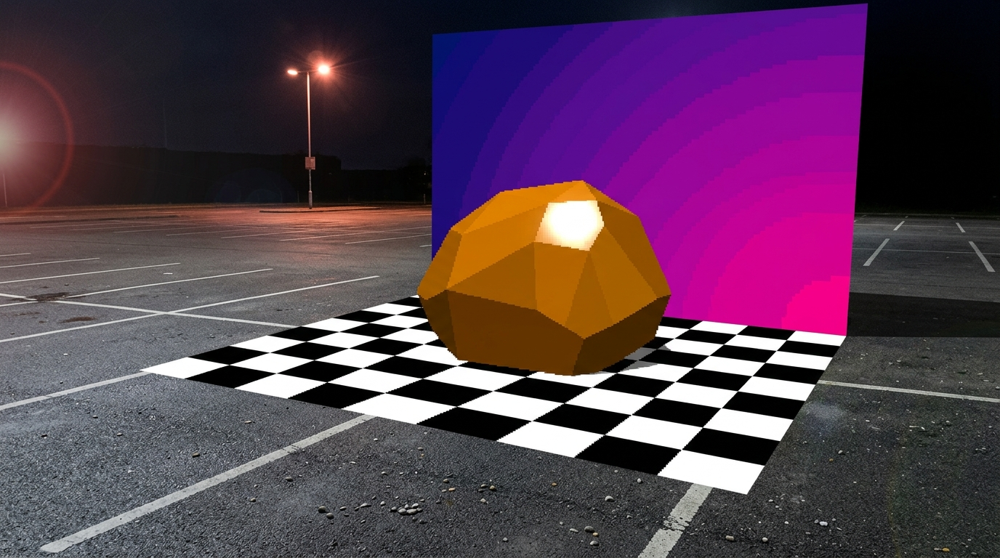
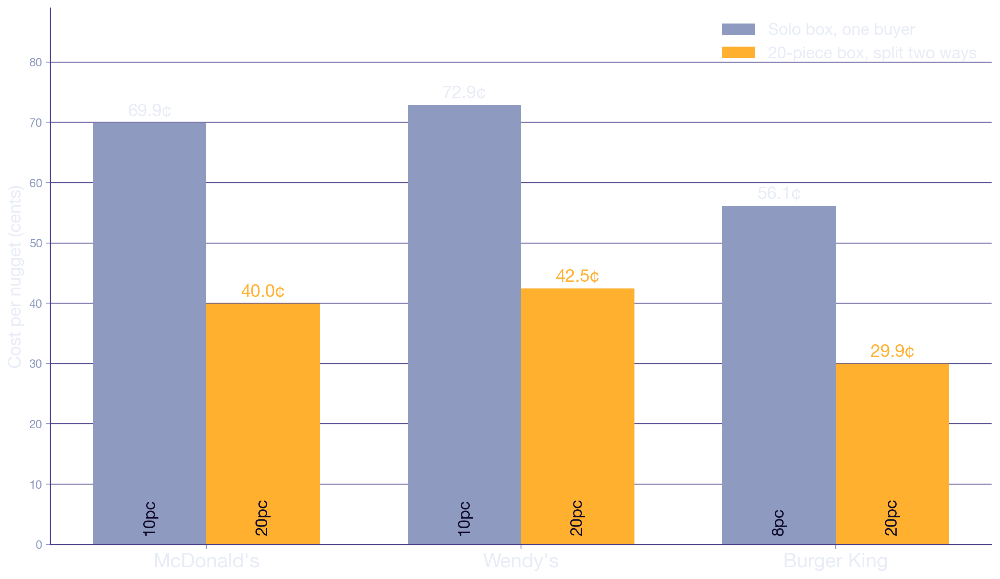
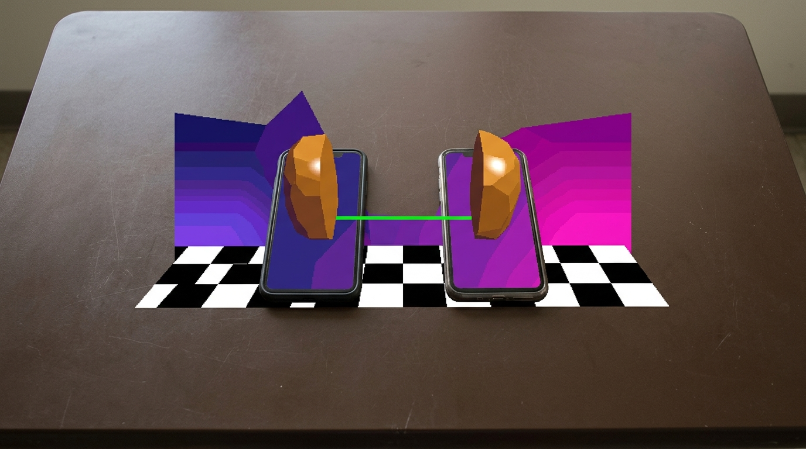
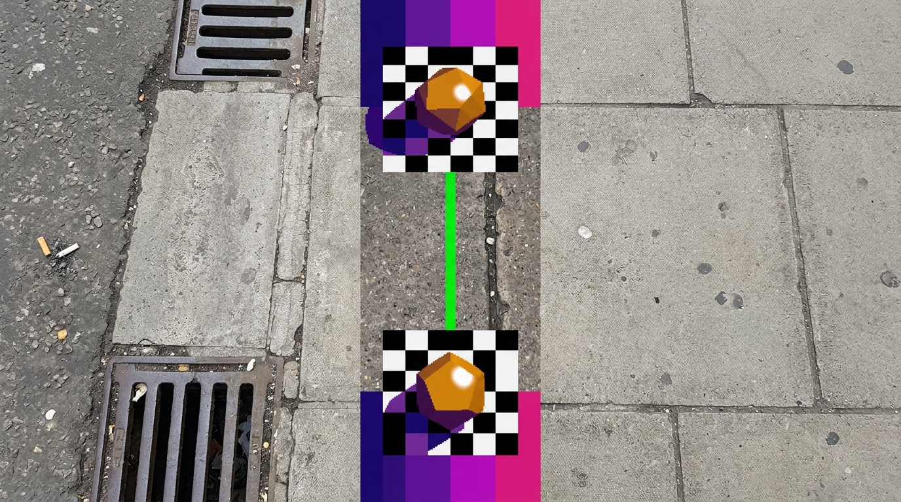
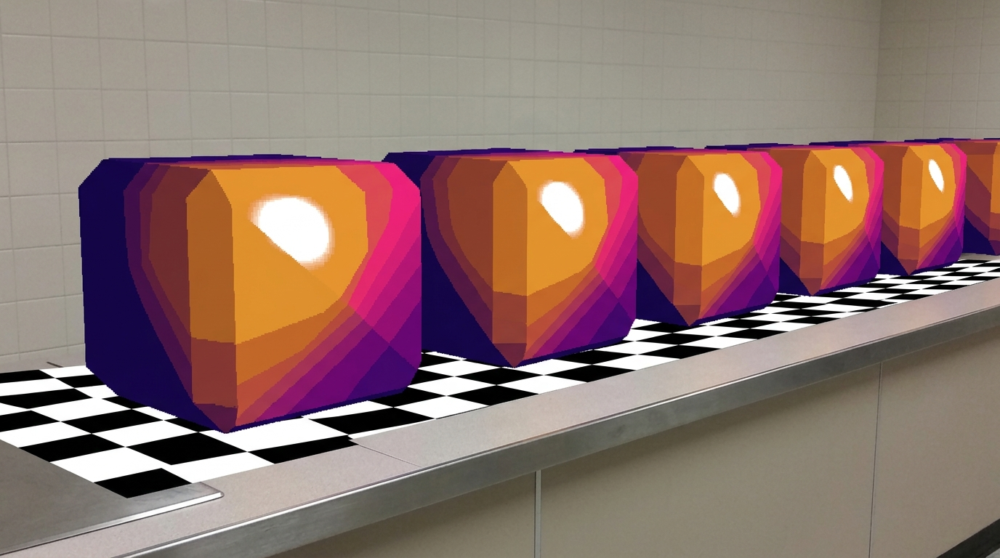
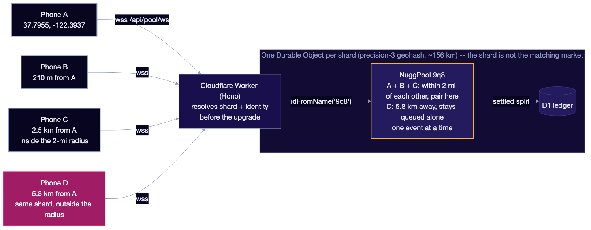
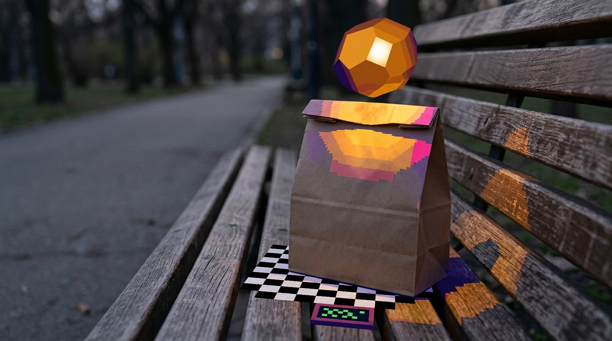

<!-- _class: title -->
<!-- _footer: "" -->
<!-- anvil-imagegen: title-counter style=nugg-1996-composite -->

# NuggBudz

## Split a 20-piece box with the stranger next to you

_Hackathon pitch · live at `nuggbudz.com` · 2AM Logic_

Concept render — generated imagery, not a photograph of a real restaurant or product.

<!-- speaker: Open with a phone already on the app. One line: fast food prices bulk cheaper than solo, we pair two strangers in the same block to split a box, and it is running right now. Then move — the arithmetic is the pitch. -->

---

<!-- _class: section -->
<!-- anvil-imagegen: divider-spread style=nugg-1996-composite -->

# The spread is real

Concept render — generated imagery, not a photograph of a real restaurant or product.

<!-- speaker: Two seconds. Say the line and move: everything that follows is arithmetic on a price difference that already exists on the menu. -->

---

## Buying for one is the expensive way to buy

A 20-piece box is **$7.99**. A 10-piece is **$6.99** — 87% of the price for half the food.

- Two people in the same queue pay $13.98 for what $7.99 buys
- Neither of them has any way to find the other
- The tax lands on whoever is eating alone

<!-- speaker: These are the prices in shared/deals.ts, which is what the deployed API charges. The point is not that fast food is expensive; it is that the cheap unit price is attached to a quantity one person will not buy. -->

---

## The inversion is the whole category, not a promo

_$0.40 a nugget in the 20pc against $0.70 solo — a 1.75× premium for buying small._

<!-- speaker: Three chains, same shape. Wendy's and Burger King price the same inversion. If this were one promo it would be an arbitrage with an expiry date; it is how the category prices protein, so the spread is structural. -->

---

## Why now

- **Chains moved value into bulk bundles** — the cheap unit price is only on the box one person will not finish
- **Stateful edge compute went per-object cheap** — a whole metro's live matching now fits in one addressable actor with no idle cost
- **Phones carry location and payment** — a pairing can settle before the food is cold

<!-- speaker: The middle bullet is the one that changed for builders. Matching a neighbourhood used to mean a regional service with a queue; a Durable Object is one addressable actor with a name and no idle cost — and a live radius search inside it, not the actor's own boundary, is what decides who can pair. -->

---

<!-- _class: section -->
<!-- anvil-imagegen: divider-protocol style=nugg-1996-composite -->

# Finding the second buyer

Concept render — generated imagery, not a photograph of a real restaurant or product.

<!-- speaker: The pivot. The spread is worth nothing until someone finds the other buyer while both are still hungry — that is the whole product, and the next slide is how it works. -->

---

<!-- anvil-imagegen: protocol-pavement style=nugg-1996-composite -->

## The protocol

1. Sign in, pick a deal — **no location prompt**, ever
2. The server places you in a pool **shard** — sized so your whole matching radius sits inside it
3. Another buyer within **2 miles** wants the same box → both phones are paired live
4. Longest waiter orders, the other walks over; both see the same settlement and a pickup code

Concept render — generated imagery, not a photograph of a real place or person.

<!-- speaker: Note step 2: the server derives both the shard and the 2-mile radius from the coordinates, never accepted from the client, so nobody can claim a market they are not standing in. The name your buddy sees is read off the session, not off the join message, so a connection cannot rename itself. Step 4 is first-come-first-served on the waiting side, which is what makes the queue starvation-free. -->

---

<!-- anvil-imagegen: market-counter style=nugg-1996-composite -->

## Everyone else assumes you already know the other person

| Alternative | What it does | Why it does not solve this |
| --- | --- | --- |
| McDonald's, Wendy's, Burger King apps | Sell the cheap bulk box | Assume one buyer eats twenty nuggets |
| DoorDash / Uber Eats group orders | Share a cart via a link | You must already have the other person |
| Splitting with a friend | Works perfectly | Requires a friend, here, hungry now |

_Cross-merchant, cross-cell liquidity — no chain app pools it._

Concept render — generated imagery, not a photograph of a real product.

<!-- speaker: Nobody matches strangers by real-time proximity. Not because it is a bad idea, but because introducing two strangers over money reads like a support problem until the settlement is exact to the cent and neither party has to negotiate. And the chain that could copy it would only ever pool its own buyers in its own app — half the liquidity, by construction. The panel on the right is a concept render, not a photograph of anyone's restaurant. -->

---

## Who pays what, to the cent

| Line | Amount |
| --- | ---: |
| Two solo 10pc boxes | $13.98 |
| One 20pc box | $7.99 |
| Pairing fee | $0.99 |
| **Each buyer pays** | **$4.49** |
| **Each buyer saves** | **$2.50** (36%) |

_Platform keeps $0.99 — 11% of the $8.98 collected. Integer cents; shares sum back exactly._

<!-- speaker: This is settle() in shared/economics.ts, the same function the Worker runs. Money is integer cents everywhere and divideCents guarantees the shares sum back to the total, with any odd cent going to the orderer — the person holding the box is the one who can absorb it without a support ticket. -->

---

## The spread is in every deal in the catalogue

| Merchant | Box | Solo | Each pays | Each saves | Spread |
| --- | ---: | ---: | ---: | ---: | ---: |
| McDonald's | $7.99 | $6.99 | $4.49 | $2.50 | $5.99 |
| Wendy's | $8.49 | $7.29 | $4.74 | $2.55 | $6.09 |
| Burger King | $5.99 | $4.49 | $3.49 | $1.00 | $2.99 |

_Gross retail spread per pairing — $5.99 is 43% of the $13.98 two solo buyers would spend._

<!-- speaker: Burger King's solo baseline is an 8-piece, so its split also buys you more food than going alone — the saving understates it. Prices are per market and per promo, which is exactly why they live in a catalogue and not in a call site. -->

---

## One Durable Object per shard — a 2-mile radius decides who pairs

_The **radius** is the market, not the shard. One event at a time: no double-pairing._

<!-- speaker: Three things make this the right shape. The object's name is a coarse geohash — a shard, not the market — chosen so a 2-mile radius always sits inside one rather than being clipped by it; the radius alone decides who can pair. Durable Objects process one event at a time, so two buyers cannot be paired to the same third party — there is no lock, transaction or compare-and-swap in pool.ts and none is needed. And per-connection state lives in the socket's hibernation attachment, so an idle shard evicts between rushes without losing the queue. The Worker resolves both the shard and the buyer's identity before the upgrade, so neither is anything the client can claim. This is also the bridge from the money slides: the spread is only worth anything if the second buyer is found while both are still hungry. -->

---

## Deployed, and verified end to end

- `nuggbudz.com` — real two-phone pairing over WebSockets
- **Every** end-to-end check passes across Worker, Durable Object, KV and D1
- Settlement, geo, matchmaking and the wire protocol are pure logic, tested without a runtime
- **Not yet proven**: no users, no revenue, no pilot — that is what the ask is for
- Shipped in the hackathon window by an agent pipeline — every feature a reviewed,
  CI-green pull request by `rjwalters` and `turian`

<!-- speaker: The checks are scripts/smoke.mjs against a real running stack, not a mock: two independent sockets in one cell, complementary roles, identical settlement, a buddy name that comes from the session rather than the wire, a buyer outside the radius left waiting, and a survivor requeued when their buddy disconnects. The largest block is the pickup handshake — only the orderer is told the code, a wrong code settles nothing, one side confirming alone arms a dispute deadline instead of booking, and a row reaches the D1 ledger only when both sides confirm. A judge can pair without creating an account because the deployment sets ALLOW_DEMO_PAIRING at deploy time — sign-in exists and works, demo mode is an explicit deploy-time flag that hands an unauthenticated socket a throwaway demo: identity, and the screen says so rather than implying someone signed in. Say the fourth bullet out loud rather than waiting to be asked, and if asked who built it, the answer is the pipeline — Curator, Builder, Judge, Doctor and Champion, merging as rjwalters and turian. -->

---

## Live demo — two phones, one cell

| Plan | What happens |
| --- | --- |
| **A** | Judges open the URL on their own phones and pair with us |
| **B** | Our two phones on a hotspot — same flow, same cell |
| **C** | No usable edge geo → the server places us in the fixed demo cell and says so on screen |
| **D** | No network at all → the recorded end-to-end runs in `refs/smoke-runs.md` |

<!-- speaker: Run Plan A if the room has wifi; it is the strongest version because it is their device, not ours — and demo pairing is on, so there is no account to create. Plan C is not a workaround, and there is nothing left to deny: the server places every socket itself, from Cloudflare's edge geo, and only when there is no usable one — offline, or a trimmed box carrying no coordinates — from a fixed demo cell (`shared/location.ts`). The screen names which of the three rungs placed you, and only the opt-in one is ever called exact, because a hackathon venue is exactly where a real fix dies. Never fake a fix. -->

---

## The model is arithmetic on the fee

| Pairings in one cell | Platform | Buyer savings unlocked |
| ---: | ---: | ---: |
| 10 | $9.90 | $50.00 |
| 25 | $24.75 | $125.00 |
| 100 | $99.00 | $500.00 |

_Gross of processing, support and fraud. $5.00 saved per pairing: the spread splits 83% buyer / 17% platform._

<!-- speaker: Deliberately not a forecast: there is no demand data, and inventing a curve would be the least credible thing in this deck. The platform column is fee revenue, not contribution — processing alone is a real fraction of it, and we would rather name the exclusion than guess a rate. The merchant is not a counterparty here: they are paid full menu price by the orderer, so the fee needs nobody's consent but the buyer's, and the buyer keeps most of the spread. -->

---

<!-- _class: ask -->
<!-- anvil-imagegen: ask-bench style=nugg-1996-composite -->

## Judges: open it on your phone and pair with us

Then one pilot cell — one store cluster, 30 days — to measure the number we cannot derive: how long a buyer will wait for a buddy.

_2AM Logic · `rjwalters` · `turian` · nuggbudz.com_

Concept render — generated imagery, not a photograph of a real place or person.

<!-- speaker: Lead with the ask a judge can act on in this room. The pilot is the second ask, and it buys exactly one thing: the first settled paid split, with Stripe Connect taking the pairing fee as an application fee — the next commit, not a roadmap item. End on the ask, then take questions. -->

---

<!-- _class: appendix -->

## Appendix — every figure here is derived, not typed

- `shared/deals.ts` + `shared/economics.ts` are the only sources of money in this deck
- `scripts/deck-ledger.ts` derives each figure; `test/deck.test.ts` fails if a slide disagrees
- Reprice a deal and `pnpm test` goes red until the slides are corrected
- Chart data is generated from the catalogue, so the figure cannot outlive a price change
- Every generated image carries its prompt, model and hash in `assets/_prompts.json`

<!-- speaker: This is the slide for the judge who wants to audit. The check runs in both directions: a number on a slide that the code does not produce fails, and a number the code produces that the deck dropped fails too. Nothing in the pitch was retyped from a spreadsheet. The last bullet is the same discipline applied to the pictures: every generated image is a concept render, labelled as one, and its prompt is in the tree next to it. -->
